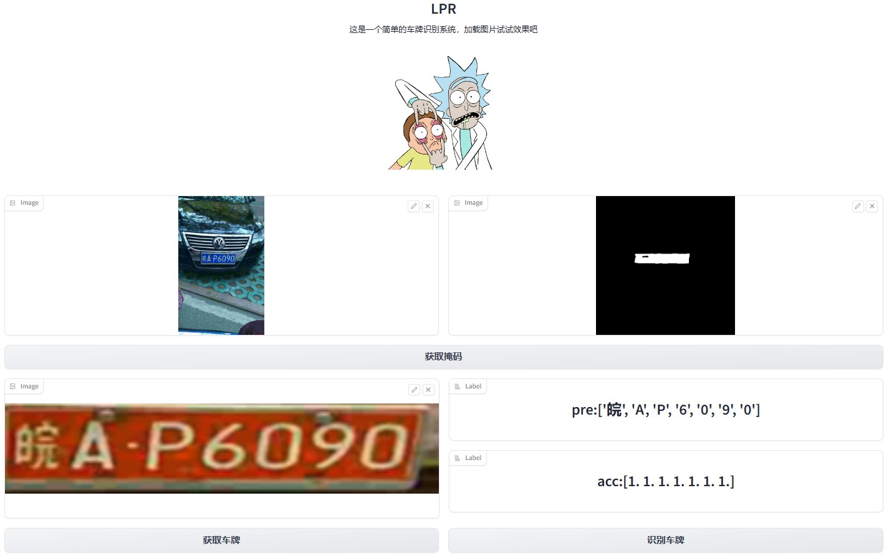

# 车牌识别系统

[](LICENSE)
[](LICENSE)
## 项目描述

车牌识别系统是基于深度学习技术的一个应用，旨在通过图像处理和模式识别算法实现对车牌的自动识别和提取。该系统采用了UNet网络进行车牌分割和CNN网络进行车牌识别，可以准确、高效地识别车辆上的车牌信息。

系统的工作流程如下：

1. 图像预处理：对输入的图像进行预处理，包括图像去噪、增强和尺寸调整等操作，以提高后续车牌分割和车牌识别的准确性。
2. 车牌分割：使用训练好的Unet网络对预处理过后的图像进行图像分割，将车牌从背景中提取出来。Unet网络具有强大的特征提取和语义分割能力，可以精确的定位车牌。
3. 车牌识别：将车牌分割得到的车牌输入到CNN网络中，通过卷积层特征提取，经由全连接层连接，最终在输出层输出车牌的字符序列。


## 安装

1. 克隆仓库：

   ```shell
   git clone https://github.com/xiao-dan-1/LPR.git

2. 进入项目目录：
    ```shell
   cd LPR
3. 安装依赖项：
    ```shell
   pip install -r requirements.txt

4. 运行车牌识别系统:
    ```python
   python LPR_Demo.py

- （测试图片可使用datasets/Test_Images,来源CCPD部分数据）

## 使用说明

[如何使用，输入数据格式、调用方法、示例代码]

- 数据集：使用的是[CCPD](https://github.com/detectRecog/CCPD),我在datasets/CCPD/CCPD.py中定义了CCPD数据集的属性和方法,包括生成掩码，生成车牌
- *_train：用于训练网络模型
- *_eval：用于评估模型性能
- *_predict：用于模型预测
- *_demo：简单的示例

## 功能特点

* 使用UNet网络进行车牌分割
* 使用CNN网络进行车牌识别
* 实现准确的车牌识别功能

## 示例

### GUI Demo

```shell
python gui_demo.py
```

### Web Demo

首先安装 Gradio：pip install gradio，然后运行仓库中的 web_demo.py：

```shell
python web_demo.py
```


## 改进
- 由于使用的Unet网络实现端到端的识别，所以数据集的数据量过大，训练中只使用了5000张图片进行训练
- CCPD数据集的车牌主要是安徽地区，存在地区分布不均匀，导致识别网络对第一个字符的效果不佳，需要使用地区分布均匀的数据集用于识别网络训练

## 致谢

[提供帮助、支持、灵感]

## 常见问题

暂无常见问题。